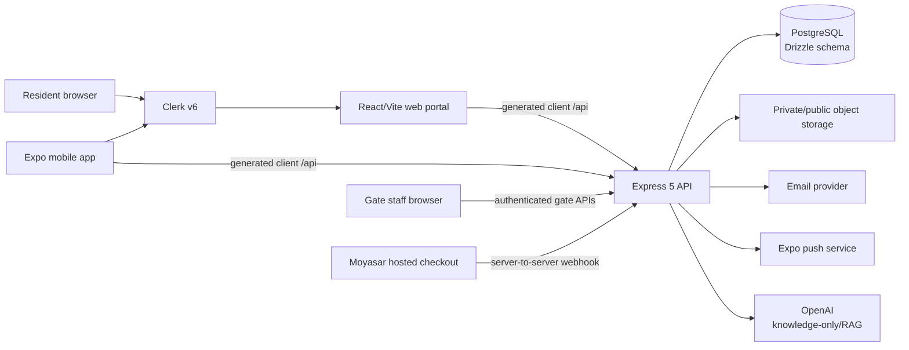

# Madain Village HOA Platform — System Blueprint

**Generated:** 2026-08-25  
**Authority:** Current repository source and accepted development/UAT evidence.  
**Purpose:** Current architecture, business boundaries, data ownership, security controls, and operational acceptance state.  
**Important boundary:** This document describes the system as implemented in the repository. It does not inspect production, apply migrations, authorize deployment, or claim that a live Moyasar callback has been observed.

## 1. Executive summary

Madain Village is a bilingual English/Arabic community-management platform for:

- residents who verify a unit and use resident services;
- administrators who manage the community and approve controlled actions; and
- gate staff who verify credentials and record physical access events.

The product is a pnpm monorepo with three product runtimes and one development-only visual preview runtime:

| Runtime | Location | Responsibility |
| --- | --- | --- |
| API server | `artifacts/api-server` | Express REST API, authentication boundary, authorization, lifecycle rules, payments, notifications, object-storage policy, and schedulers |
| Web portal | `artifacts/hoa-portal` | Public entry, resident portal, administrator console, and security-gate console |
| Mobile app | `artifacts/hoa-mobile` | Expo/React Native resident experience |
| Mockup sandbox | `artifacts/mockup-sandbox` | Isolated component previews; not a product data or production runtime |

The primary architectural invariant is **unit-anchored access**: a signed-in identity is not sufficient for resident privileges. The API resolves the Clerk identity to a local user, then applies role, verification state, active unit linkage, ownership, and subject scope.

## 2. System context



### Request and routing boundaries

- The API is mounted at `/api`.
- The portal is served by its artifact path and uses a separate base-path helper so `/hoa-portal/` remains distinct from the host root.
- Clerk proxy handling and Clerk middleware are configured at the API boundary.
- `PORT` is required at API startup; the server fails explicitly when it is absent or invalid.
- The webhook callback is a public provider endpoint, but it validates the provider secret and event envelope before charge lookup or settlement.
- The browser payment return is informational and polls recorded state; it is not a settlement authority.

## 3. Technology and package architecture

| Layer | Current implementation |
| --- | --- |
| Runtime | Node.js 24 |
| Language | TypeScript 5.9, strict composite workspace |
| Package manager | pnpm workspaces |
| API | Express 5, `@clerk/express`, Pino logging |
| Web | React, Vite, Wouter, TanStack Query, shadcn/ui, Tailwind CSS |
| Mobile | Expo SDK 54, React Native, Expo Router |
| Database | PostgreSQL through Drizzle ORM |
| Identity | Clerk v6, Replit-managed tenant |
| API contract | Hand-authored OpenAPI → Orval-generated React Query client and Zod schemas |
| Validation | Zod and generated request/response validators |
| Files | Presigned object-storage uploads and private download policy |
| Payments | Moyasar provider implementation; deterministic provider only for non-production tests |
| AI | OpenAI-backed document retrieval; embeddings stored as JSON text and cosine similarity calculated in JavaScript |
| Notifications | Persisted email and Expo push outbox with idempotency, preference policy, retry, and delivery state |
| Testing | Vitest unit/integration tests and Playwright browser tests |

### Source-of-truth order

1. Runtime behavior in `artifacts/*/src` and shared libraries.
2. Drizzle schema in `lib/db/src/schema`.
3. OpenAPI contract in `lib/api-spec/openapi.yaml`.
4. Generated clients and validators regenerated from the contract.
5. Evidence and blueprints as explanatory records, never as substitutes for source.

## 4. Identity, roles, and authorization

### Roles

The current database role set is:

| Role | Authority |
| --- | --- |
| `admin` | Full administration, sole approval role, configuration, recovery operations, and release execution |
| `owner` | Verified unit-owner actions, resident services, tenant decisions for the owner’s unit, and ownership-change initiation |
| `tenant` | Verified resident services; cannot decide their own tenancy renewal or initiate owner-only actions |
| `guard` | Gate and restricted staff operations; not an approver and not a resident-service approver |

Shared groups are:

- `STAFF_ROLES = [admin, guard]`
- `APPROVER_ROLES = [admin]`
- `GATE_ROLES = [admin, guard]`

There is no active `supervisor` or `approver` database role.

### Authentication path

1. Clerk authenticates the external identity.
2. The API calls `req.auth()` through Clerk v6 middleware.
3. `/api/users/me/sync` provisions or reconciles the local `users` row.
4. The portal waits behind a bootstrap gate until local profile synchronization settles.
5. Every protected API route resolves the local caller before evaluating scope.

The first-sign-in path is conflict-safe and single-flight from the portal so concurrent profile synchronization cannot expose a blank or partially provisioned portal.

### Verification state

Verification is independent of role. Current states include:

`unverified`, `pending_manual`, `pending_owner_approval`, `verified_owner`, `verified_tenant`, `linkage_ended`, `pre_approved`, and `verified_household_member`.

Owner verification can auto-match the official unit registry or enter manual review. Tenant verification requires a verified unit owner, Ejar evidence, and an owner decision. An administrator may review other records but does not replace the owner’s tenancy decision.

### Portal route guard

The web portal declares every page in `ROUTE_CONFIGS` with one of:

- `auth: "none"` — public;
- `auth: "any"` — any signed-in user, still behind the portal bootstrap gate; or
- `auth: "roles"` — signed-in user with a non-empty explicit role allowlist.

The admin and security-gate path prefixes are statically checked so a restricted page cannot accidentally be added with a weaker guard. Signed-out users are sent to Clerk rather than a blank portal.

## 5. Data architecture

The Drizzle schema currently exports **31 schema modules** describing **42 public tables**. The frozen development catalog verifier records:

```text
42 public tables
575 public columns
112 public constraints
139 public indexes
3 non-internal triggers
```

The schema is grouped by business responsibility:

### Identity, units, and verification

`users`, `units`, `unit_registry`, `unit_verifications`, `unit_verification_owner_id_attempts`, `unit_verification_document_cleanup_retries`, `parking_lots`, and `data_migration_corrections`.

These tables anchor external identity, unit ownership/occupancy, official registry matching, title-deed/Ejar verification, cleanup retries, parking allocation, and controlled data corrections.

### Household and lifecycle

`residents`, `household_invitations`, `tenancy_lifecycles`, `tenancy_renewals`, `move_forms`, `ownership_change_events`, `release_operations`, and `external_identity_deletion_jobs`.

These tables retain resident history while allowing a terminal release to detach identity-linked records, preserve unit attribution, record an idempotent operation, and queue external identity deletion.

### Facilities, bookings, and payments

`facilities`, `facility_booking_audit`, `bookings`, `permits`, and `payment_attempts`.

Bookings retain service date, unit, payment, and facility snapshots. Payment attempts are the durable payment state machine and connect a provider charge to exactly one payable subject.

### Guests, vehicles, and Waha access

`guests`, `guest_passes`, `guest_pass_verification_logs`, `guest_entry_exit_logs`, `vehicles`, `waha_pass_applications`, `waha_pass_credentials`, `waha_pass_events`, and `waha_guest_day_passes`.

Credential records and access logs are separate from resident identity. Waha lifecycle events provide an audit trail for approval, revocation, loss, replacement, and resident archival.

### Documents, communications, announcements, and configuration

`document_folders`, `documents`, `communications`, `announcements`, `announcement_edit_history`, and `hoa_settings`.

Folder visibility is a database-enforced minimum. Documents may be tightened above that minimum, but legacy public flags cannot lower it.

### Notifications, AI, and rate limits

`notification_preferences`, `notification_events`, `push_tokens`, `ai_knowledge_documents`, `ai_knowledge_chunks`, and `api_rate_limit_counters`.

Notification events are durable outbox rows. AI knowledge is separate from resident operational data. Rate-limit counters support durable fixed-window limits.

## 6. Core business flows

### 6.1 Resident onboarding

1. Clerk creates or authenticates the identity.
2. The portal synchronizes the local user.
3. The resident selects owner or tenant verification.
4. Owner claims are matched against the unit registry or routed to manual review.
5. Tenant claims require a verified owner and enter owner approval.
6. Verification and active unit linkage unlock resident operations.

No client-provided role or unit claim is trusted as authorization.

### 6.2 Facility booking

The server evaluates active facility configuration, operating hours, slot grid, duration, advance window, capacity, daily household limits, cleaning buffers, and resident eligibility. A per-facility advisory transaction lock prevents buffered-overlap races across different start times.

Paid resident bookings reserve a `pending_payment` hold. The hold scheduler expires unpaid reservations. Free and administrator bookings can confirm directly; administrators are exempt from resident Waha eligibility.

`HOA COMMON` is a system unit for internal administrator booking attribution. It is not claimable, searchable as an ordinary resident unit, or eligible for release.

### 6.3 Payment settlement and recovery

Supported purpose handlers are:

- `facility_booking`
- `guest_day_pass`
- `waha_replacement`

The flow is:

1. Create a local pending payment attempt.
2. Create the provider charge with amount, currency, purpose, user, unit, and attempt metadata.
3. Redirect the user to hosted checkout.
4. Receive a provider webhook or use the restricted admin recovery control.
5. Directly verify the provider charge.
6. Match paid status, amount, currency, and metadata.
7. Run the purpose handler through the exactly-once settlement transition.

The Moyasar webhook contract is currently **documentation-derived, not observed**. The implementation expects `secret_token`, top-level event `id`/`type`, and nested `data.id`. The first real test-mode payment is the acceptance check for this shape. A provider-pending verification remains retryable and does not issue an entitlement.

The admin recovery endpoint accepts only a provider Charge ID and is server-restricted to active administrators. It cannot force-settle an unpaid, unknown, mismatched, failed, or terminally ineligible attempt.

### 6.4 Tenancy expiry and release

Renewal opens 60 days before lease end. Saudi local date governs expiry. Expiry suspends the tenant and tenant Waha access; it does not immediately delete the account.

Without a pending renewal, the configured deletion delay defaults to 30 days, with mandatory reminders at 14, 7, and 1 days. Terminal release delegates to the shared release engine, which:

- locks the unit, subject, and trigger;
- validates the active linkage and idempotency key;
- revokes Waha applications and credentials;
- marks residents moved out;
- cancels future non-cancelled bookings while retaining historical unit attribution;
- anonymizes dependent PII;
- detaches user references;
- records the release operation and external identity-deletion job; and
- persists the mandatory access-deactivated notification before account deletion.

The same engine is used for move-out, tenancy expiry, and ownership-change release triggers.

### 6.5 Guest and gate access

Residents register guests; an administrator approves the request and the system creates a unique guest pass. Gate endpoints separately enforce gate roles. Public token verification returns only the minimum information needed for gate operation, while entry/exit events retain guard identity and time.

The Waha credential scan path is authenticated and gate-restricted. Lost, stolen, or damaged credentials enter a replacement path; replacement issuance is payment-backed and idempotent.

### 6.6 Documents and storage

Administrator-only mutations use presigned uploads, MIME/size validation, canonical private namespaces, and short-lived URLs. Downloads repeat visibility checks and use non-caching view responses. Archived documents are omitted.

The minimum folder visibility ordering is:

```text
all_portal_users < verified_owners < admin_only
```

Legacy external document URLs are not treated as an access path.

### 6.7 Notifications

The notification service persists email and push intent before delivery. Each recipient/channel has a stable idempotency key, so repeated business events do not duplicate a channel delivery.

The catalog contains all 16 X3 event types with explicit Arabic and English subject/title/body copy. Arabic is the default locale; only an explicit English locale selects English. Events 9 and 12 are mandatory and bypass preferences.

Delivery retries use exponential backoff and transition to failed after five attempts. The notification scheduler runs independently of business transactions.

### 6.8 Dalil knowledge assistant

Administrators upload source documents into the knowledge base. The API extracts/chunks content, stores embeddings as JSON text, retrieves by JavaScript cosine similarity, and sends relevant context to OpenAI.

Dalil is knowledge-only. It does not make authorization decisions, approve workflows, settle payments, or replace resident privacy/consent controls.

## 7. API surface

All API paths are under `/api`. The route registry mounts 27 route modules; the payment webhook is nested within the payment routes.

| Domain | Responsibilities | Effective access |
| --- | --- | --- |
| Health and public verification | Health check, public guest-pass verification | Public where explicitly declared |
| Users and provisioning | Current-user sync/profile, admin user management, gate resident lookup | Authenticated; admin or gate scope as applicable |
| Units and verification | Registry, owner/tenant verification, title-deed/Ejar evidence, parking, corrections | Authenticated; owner/admin/unit scope |
| Facilities and bookings | Facility catalog, availability, booking admission, cancellation, confirmation | Public catalog; authenticated resident/admin actions |
| Permits and move forms | Permit lifecycle, move workflows, review decisions | Authenticated; owner/admin scope |
| Guests and passes | Guest registration, approval, QR/token access, gate entry/exit | Resident/admin/gate scope |
| Vehicles and residents | Household directory and vehicle registration | Owner/admin/self scope |
| Waha and day passes | Eligibility, applications, decisions, credentials, lost/replacement, paid day passes | Verified resident/admin/gate scope |
| Documents and storage | Folder policy, upload, download, archive, replacement | Admin mutation; visibility-checked reads |
| Announcements and communications | Bilingual content, edit history, resident submissions | Public/resident reads; admin mutations |
| AI | Knowledge documents, status, chat, suggestions | Authenticated; knowledge administration is admin-only |
| Payments | Booking checkout, webhook, history, retry, admin reconciliation | Public provider callback; authenticated ownership/admin controls |
| Notifications and preferences | Push tokens and resident preferences | Authenticated self scope |
| Ownership, tenancy, release | Ownership changes, renewal, release requests, execution, deletion jobs | Owner/tenant/admin scope by operation |

## 8. Security and privacy controls

- Clerk authentication is validated server-side; protected routes explicitly call the auth middleware.
- Portal routes use a typed central registry with static guard assertions.
- API handlers enforce role, ownership, verification, active linkage, and subject scope.
- Sensitive gate lookup subjects use normalized, domain-separated keyed HMACs rather than raw identifiers as rate-limit subjects.
- Sensitive endpoints use durable fixed-window limits, with separate scopes for lookup, payment, webhook, reconciliation, and AI operations.
- Logs record rejection reasons and safe metadata without payment bodies, secrets, or raw callback payloads.
- Document visibility is a database-enforced floor and is rechecked at download time.
- SG10 is a hard constraint: resident photos are not collected, stored, requested, or displayed; guards use physical ID when identity is in doubt.
- Approval decisions preserve their required basis and audit fields; gender data required by the verification contract is persisted rather than inferred.
- Tenant approval remains an owner decision; staff role membership cannot bypass that business rule.
- Release operations are locked, idempotent, auditable, and postcondition-checked.
- Retention and purge jobs remove or anonymize data according to the accepted lifecycle rules while preserving necessary operational history.

## 9. Client surfaces

### Web portal

The portal includes public home/authentication/payment-result entry, resident pages for dashboard, announcements, facilities, permits, documents, residents, guests, vehicles, unit verification, communications, AI, payments, maintenance, Waha Pass, and ownership change, plus admin historical records and the security-gate console.

The UI supports English/Arabic translation, Arabic RTL layout, resident bootstrap/error states, role-aware navigation, and provider-payment result polling without client-side settlement authority.

### Mobile app

Expo Router provides sign-in/sign-up, authenticated tabs for announcements, bookings, chat, communications, documents, guests, permits, profile, vehicles, and Waha Pass, plus unit verification. Mobile document access uses the authenticated API download contract.

The mobile development workflow is separate from the web/API workflows and uses its Expo-specific preview host.

## 10. Schedulers and operational assumptions

The API starts these jobs after it begins listening:

- move-out processing;
- ownership-change processing;
- booking payment-hold expiry;
- notification dispatch;
- external identity-deletion retries;
- tenancy lifecycle/expiry processing; and
- guest-history purge.

The server logs a warning that scheduler behavior assumes exactly one API server instance. A multi-instance deployment requires distributed locking before scaling the API horizontally.

Development migrations and schema verification are separate operational concerns. This blueprint does not authorize `db:push`, automatic migration, database reset, production schema inspection, or deployment.

## 11. Current acceptance snapshot

The latest accepted development evidence records:

- API suite: **1,383 passed, 21 skipped, 0 failed; 1,404 total**
- API type check: passed
- Portal type check: passed
- OpenAPI client/Zod generation: passed
- H4 schema integrity verification: passed
- Frozen development catalog: **42 tables, 575 columns, 112 constraints, 139 indexes, 3 non-internal triggers**
- Focused browser recovery test: passed; an unknown Charge ID was safely rejected without provider activity, payment creation, or entitlement issuance

The following boundary remains explicit:

- Moyasar payload shape is documentation-derived and has not yet been observed from the connected account.
- A real test-mode payment is required to confirm callback shape, HTTP 200 delivery, exactly-once entitlement issuance, and notification delivery.
- Production access, production writes, live provider calls, automatic migration, and deployment are outside this blueprint.

## 12. Source index

- API composition: `artifacts/api-server/src/app.ts`, `artifacts/api-server/src/index.ts`, `artifacts/api-server/src/routes/index.ts`
- Authorization: `artifacts/api-server/src/middlewares/requireApiAuth.ts`, `artifacts/api-server/src/lib/roles.ts`
- Web route registry: `artifacts/hoa-portal/src/App.tsx`
- Mobile routes: `artifacts/hoa-mobile/app/`
- Schema: `lib/db/src/schema/`
- API contract: `lib/api-spec/openapi.yaml`
- Generated client and validators: `lib/api-client-react/src/generated/`, `lib/api-zod/src/generated/`
- Payments: `artifacts/api-server/src/payments/`, `artifacts/api-server/src/routes/paymentWebhook.ts`, `artifacts/api-server/src/routes/payments.ts`
- Tenancy and release: `artifacts/api-server/src/lib/tenancyLifecycle.ts`, `artifacts/api-server/src/lib/releaseSubject.ts`
- Notifications: `artifacts/api-server/src/lib/notificationCatalog.ts`, `artifacts/api-server/src/lib/notificationService.ts`
- Documents/storage: `artifacts/api-server/src/routes/documents.ts`, `artifacts/api-server/src/routes/storage.ts`, `artifacts/api-server/src/lib/objectStorage.ts`
- Verification evidence: `evidence/go-live/`, `evidence/pre-go-live/`, and `evidence/security-guard/`