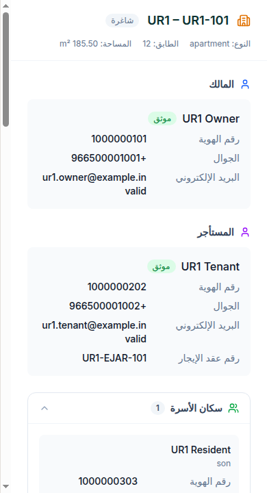
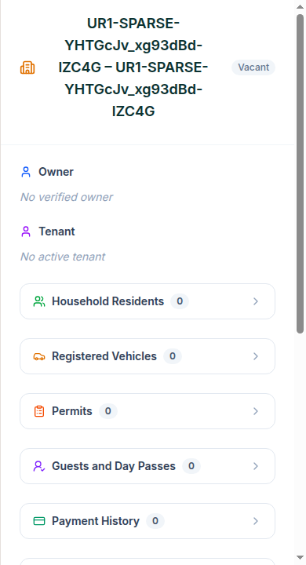
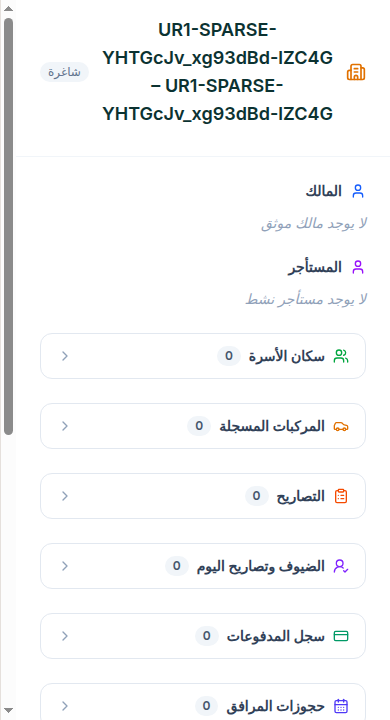
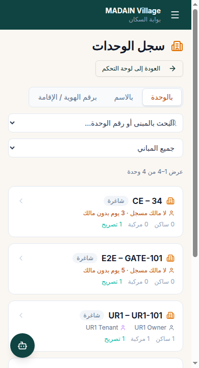

# UR1 Unit Registry — Fresh Browser UAT

Date: 2026-08-31  
Result: PASS

## Freshness method

Earlier follow-up runs reused a persistent tester conversation/browser state and cited the old screenshot ID `banyrb`. That was evidence carry-over, not a current-build result.

The accepted run:

1. Started a brand-new isolated browser context.
2. Used a newly generated sparse-unit marker.
3. Disabled browser cache through CDP with `Network.setCacheDisabled(true)`.
4. Reloaded the current portal.
5. Required new screenshot IDs and descriptions containing the marker.
6. Exported the captures before deleting the temporary fixture.

No prior screenshot ID was reused.

## Populated-unit checks

- Intercepted `GET /api/admin/units/full`.
- Confirmed the UR1 unit contains owner, tenant, household resident, vehicle, Waha data, four permit types, legacy guest and QR pass, Guest Day Pass, payment, booking, and resolved facility name.
- Confirmed HOA COMMON is absent from data, totals, and building filters.
- Confirmed Arabic source-backed values include `booking → حجز` and `tenant → المستأجر`.
- Preserved `UR1 Owner` and `UR1 Tenant` as test-person proper names.
- Confirmed 390px document width: `innerWidth=390`, `clientWidth=390`, `scrollWidth=390`.

## UR1f sparse-unit checks

Temporary marker: `UR1-SPARSE-YHTGcJv_xg93dBd-lZC4G`

At 390px, both languages showed these empty sections as visible and collapsed by default:

- Residents
- Vehicles
- Permits
- Guests and Day Passes
- Payments
- Bookings
- Waha Passes
- Parking

English:

Arabic:

The temporary unit was deleted after export and a database count confirmed zero remaining rows.

## Additional fresh registry capture

